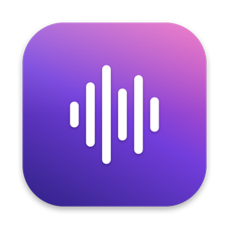

<p align="center">
  
</p>

<h1 align="center">Veyra</h1>

<p align="center"><b>Your voice, understood.</b><br>
Private, unlimited voice dictation for macOS — hold <b>Fn</b>, speak, release, and your words appear wherever your cursor is. Say a command instead, and Veyra edits for you.</p>

---

## Features

- **Works in any app** — Notes, Slack, VS Code, browsers, Terminal.
- **Private by default** — Whisper runs on your Mac. No account, no usage limits, works offline.
- **Clean text** — with [Ollama](https://ollama.com), filler words are removed, punctuation fixed, and spoken lists turned into bullet points by `gemma4` on your Mac. If you add `gemma4:cloud`, it is used whenever the local model is missing, too slow, or its reply is rejected.
- **Voice commands** — say "undo that", "scratch that" or "new line" and Veyra presses the keys for you.
- **Actions** — hold **Fn + Control** and say "open Slack", "open my resume", "make this more formal" or, in a terminal, "find all PDFs in Downloads".
- **Noise-aware** — Apple voice processing plus optional Voice Isolation for busy rooms.
- **Clipboard-safe** — your previous clipboard is restored after every paste.

## Requirements

- A Mac with Apple Silicon, running macOS 26.5 or later
- Xcode 26 or later (Veyra is built from source)
- An Apple ID (a free one works) for signing the build
- ~2 GB of disk for the speech model, plus ~7 GB if you add local cleanup

## Installation

### 1. Install Xcode

Install Xcode from the App Store, open it once to finish setup, then point the command-line tools at it:

```bash
sudo xcode-select -s /Applications/Xcode.app
```

### 2. Get the code

```bash
git clone https://github.com/AjaySP04/Veyra.git
cd Veyra
```

### 3. Set up signing (first time on your Mac)

macOS only grants microphone and keyboard access to signed apps, so the build must be signed with your own Apple ID:

1. Open `Veyra.xcodeproj` in Xcode.
2. **Xcode → Settings → Accounts** → add your Apple ID.
3. Select the **Veyra** target → **Signing & Capabilities**:
   - **Team:** your name (Personal Team).
   - **Bundle Identifier:** change `com.ajaysparmar.Veyra` to something unique, such as `com.yourname.Veyra`.
4. Close Xcode.


### 4. Build and install

```bash
./scripts/install.sh
```

This builds a Release copy, installs it to `/Applications`, and launches it. A V on a little sound wave appears in the menu bar; while Veyra is transcribing or working on an action, the waves roll and the V floats on them.

### 5. First launch

1. **Allow microphone access** when prompted.
2. **Turn on Accessibility:** System Settings → Privacy & Security → Accessibility → **Veyra**.
3. **Free up the Fn key:** System Settings → Keyboard → *Press 🌐 key to* → **Do Nothing**.
4. **Wait for the model:** the first launch downloads Whisper (~1.6 GB). The menu shows progress, then **Hold Fn to dictate**.

Optional: add Veyra to **System Settings → General → Login Items** to start it automatically.

### 6. Transcript cleanup (optional)

Without Ollama, Veyra pastes exactly what Whisper heard. To remove filler words and fix punctuation:

1. Download and open [Ollama](https://ollama.com/download). It runs in the menu bar.
2. Pull the local cleanup model:

   ```bash
   ollama pull gemma4:latest    # ~6.6 GB
   ```

3. Optionally, add the free cloud model as a fallback for when the local one is unavailable:

   ```bash
   ollama signin
   ollama pull gemma4:cloud
   ```

Veyra picks this up automatically; no restart is needed. The cloud model is used whenever the local one is missing, too slow, or its reply is rejected, and that sends your dictated text to ollama.com. Run `ollama rm gemma4:cloud` to keep everything on your Mac.

## Usage

| Action | How |
|---|---|
| Dictate | Hold **Fn**, speak, release |
| Act | Hold **Control**, then hold **Fn**, speak, release |
| Cancel | Press any other key while holding Fn |
| Reduce background voices | Veyra menu → **Microphone Mode…** → **Voice Isolation** |
| Quit | Veyra menu → **Quit Veyra** (⌘Q) |

Veyra transcribes in English and adapts cleanup to the app you're dictating into:

| Mode | Apps | What changes |
|---|---|---|
| Email | Mail, Outlook, Spark, Gmail and Outlook in a browser | Greeting line, paragraphs and sign-off — only when you say them |
| Chat | Slack, Teams, WhatsApp, Messages, Discord, Telegram, Google Chat and Slack in a browser | Short and casual; bullets only for an announced list |
| Editor | VS Code, Xcode, Cursor, Zed, Sublime Text, JetBrains IDEs, TextEdit, Notes | Technical terms kept exactly |
| Terminal | Terminal, Ghostty, iTerm, Warp, kitty, Alacritty, WezTerm, Hyper, Rio | Always one line, so a line break can never run a command |
| Standard | Everything else | Filler removal, punctuation and bullet lists |

### Voice commands

Hold **Fn** and say one of these phrases on its own. Capitals, punctuation and a "please" are ignored. Anything else you say is typed as usual.

| Say | Does |
|---|---|
| "undo" / "undo that" | Undo |
| "redo" / "redo that" | Redo |
| "scratch that" | Removes what Veyra just typed, if you haven't typed, clicked or switched apps since |
| "delete that" | Deletes the selection |
| "delete last word" | Deletes the word before the cursor |
| "delete line" | Deletes to the start of the line |
| "bold that" / "italic that" / "underline that" | Formats the selection |
| "select all" | Selects everything |
| "select last word" | Selects the word before the cursor |
| "go to start of line" / "go to end of line" | Moves the cursor along the line |
| "go to top" / "go to bottom" | Moves to the start or end of the document |
| "new line" / "new paragraph" | Adds a line break or a blank line |

Some commands adapt to the app:

- **Line breaks** use ⇧↩, so a chat message is never sent by accident.
- **Terminals:** nothing presses Return. Word and line deletion and line moves use the shell's ⌃W, ⌃U, ⌃A and ⌃E. Selection, formatting, document moves and line breaks are unavailable.
- **Code editors:** formatting is unavailable, because ⌘B and ⌘I do other things there. Notes and TextEdit format normally.

Letters are matched to your keyboard layout, so commands work on AZERTY, QWERTZ and Dvorak too. A command is cancelled if you switch apps before it runs, and "scratch that" does nothing while Secure Keyboard Entry is on.

When a command can't run, Veyra types nothing and shows why. Because a whole utterance is matched, you can't dictate just the words "undo that" as text.

### Actions

Hold **Control**, then hold **Fn** while you speak, and Veyra does what you ask instead of typing it. The overlay shows a ⚡ while it listens.

| Say | Does |
|---|---|
| "open Slack", "open V S code" | Opens an installed app |
| "open github dot com", "open YouTube" | Opens a website in your default browser |
| "open my downloads", "open the desktop" | Opens Desktop, Documents, Downloads, Home, Pictures, Music or Movies |
| "open my resume", "open the Veyra project folder" | Opens the best-matching file or folder in your home folder, most recently used first |
| "make this more formal", "translate this to Hindi", "make it shorter", "fix the grammar" | Rewrites the selected text in place — or what you just dictated, if you haven't typed, clicked or switched apps since |
| "git status", "find all PDFs in Downloads", "what's using port 3000" (in a terminal) | Writes the command at the prompt for you to check. It never presses Return |

Rewrites replace the text straight away; ⌘Z or "undo that" brings the original back, and your clipboard is left as it was. If you type or click while a rewrite is in progress, it is cancelled. Text you can't edit, such as a web page, is left alone. In VS Code, JetBrains IDEs, Sublime Text and Cursor, asking with nothing selected copies the current line, so its rewrite is inserted at the cursor — ⌘Z removes it.

Commands are written only in a terminal (Terminal, iTerm2, Ghostty, Warp, kitty, Alacritty, WezTerm, Hyper or Rio). Veyra clears the prompt line first (⌃Y brings back what was there in most shells), then writes one zsh command — never Return, and never anything with a line break in it. A command that deletes files, uses `sudo`, runs a downloaded script, force-pushes or erases a disk is still written, but the overlay says "Check carefully" and why. "scratch that" removes the command, and "make it recursive" changes it. The model doesn't know which folder your shell is in, so relative paths start wherever you are. Warp's own input editor may not clear the line, so the command is added to what's there.

When several files match, Veyra opens the best one and tells you how many others matched. Actions need [Ollama](#6-transcript-cleanup-optional) with `gemma4`. The first file search may ask for access to your Documents, Desktop or Downloads folder.

## Troubleshooting

| Problem | Fix |
|---|---|
| Build fails with a signing error | Complete [step 3](#3-set-up-signing-first-time-on-your-mac): choose your team and a unique bundle identifier. |
| Nothing is typed | Open the Veyra menu and grant any permission it lists. |
| Fn opens the emoji picker | Set *Press 🌐 key to* → **Do Nothing**. |
| Menu shows an error | Check your connection and click **Retry**. |
| Fn stops working after an update | Remove Veyra from Accessibility, then add it again. |
| An action says "Actions need Ollama running" | Open Ollama and check that `ollama list` shows `gemma4:latest`. |
| Text isn't cleaned up | Make sure Ollama is running and `ollama list` shows `gemma4:latest`. |

View diagnostics (never includes your words):

```bash
log stream --level info --predicate 'subsystem == "com.ajaysparmar.Veyra"'
```

## Update and uninstall

```bash
# Update (stash keeps your signing changes from step 3)
git stash && git pull && git stash pop && ./scripts/install.sh

# Uninstall (use your own bundle identifier if you changed it)
pkill -x Veyra
rm -rf /Applications/Veyra.app "$HOME/Library/Application Support/Veyra"
defaults delete com.ajaysparmar.Veyra
tccutil reset All com.ajaysparmar.Veyra
```

## Development

```bash
open Veyra.xcodeproj                                                        # run the Veyra scheme
xcodebuild test -project Veyra.xcodeproj -scheme Veyra -destination 'platform=macOS'
TEST_RUNNER_VEYRA_EVAL=1 xcodebuild test -project Veyra.xcodeproj -scheme Veyra -destination 'platform=macOS' -only-testing:VeyraTests/AgentEvalTests   # scores tool calls on live gemma4; needs Ollama
```

```text
Fn ─► FnKeyMonitor ─► DictationCoordinator ─► AudioRecorder ─► WhisperKitTranscriber ─► OllamaTextProcessor ─► PasteboardTextInserter
                                                                         └─► Intent ─► VoiceCommand.plan ─► CGEventKeystrokeSender
Fn+⌃ ─► … ─► WhisperKitTranscriber ─► AgentRunner ─► OllamaClient (tools) ─► OpenTool ─► NSWorkspace
```

Built with Swift, SwiftUI, AVFoundation, [WhisperKit](https://github.com/argmaxinc/argmax-oss-swift) and [Ollama](https://ollama.com). Each service sits behind a protocol, so engines can be swapped and the coordinator is tested with fakes.

## The story behind Veyra

The name blends **voice**, **clarity** and **presence**: **Ve** for *voice*, **yra** for *your assistant*.

We talk to machines through keyboards, screens and buttons, but people don't think in APIs — we think in conversations. Veyra is an experiment in making voice the interface between humans and software: it listens, understands the intent behind what you say, reasons about what needs to happen, and eventually acts through connected tools and services.

The goal isn't another voice chatbot. It's to explore what it takes to build a production-grade voice agent end to end — audio capture, speech recognition, reasoning, tool calling, memory, observability and reliable execution. Dictation is the first step. Read the full vision in [docs/VISION.md](docs/VISION.md).
